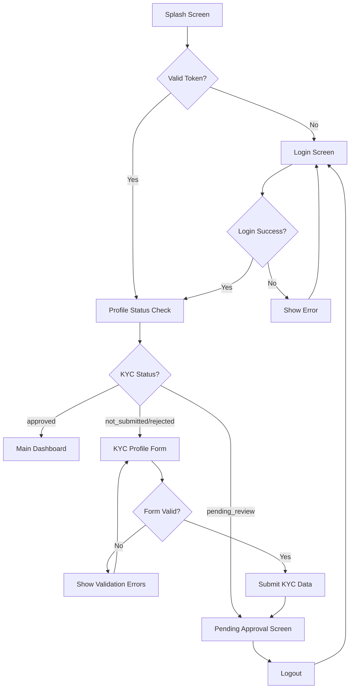

## 1. Product Overview
Synergetics Manager is a Flutter mobile application designed for pre-registered managers to complete their KYC (Know Your Customer) profile verification before accessing the main business management dashboard. The app integrates with Supabase backend services and follows a secure authentication flow where managers are created by administrators via a web portal.

The primary purpose is to streamline the manager onboarding process by providing a mobile-first KYC verification system that ensures compliance and security before granting access to sensitive business operations.

## 2. Core Features

### 2.1 User Roles
| Role | Registration Method | Core Permissions |
|------|---------------------|------------------|
| Manager | Pre-created by Admin via web portal | Can complete KYC profile, access dashboard after approval |
| Default User | Automatic profile creation on login | Basic access to KYC submission and status checking |

### 2.2 Feature Module
Our authentication and onboarding requirements consist of the following main pages:
1. **Splash Screen**: Company logo display, authentication token validation, routing logic.
2. **Login Screen**: Email/password authentication, error handling, secure token storage.
3. **KYC Profile Form Screen**: Multi-step profile completion, reference management, form validation.
4. **Pending Approval Screen**: Status display, logout functionality.
5. **Main Dashboard**: Post-approval landing page with business management features.

### 2.3 Page Details
| Page Name | Module Name | Feature description |
|-----------|-------------|---------------------|
| Splash Screen | Authentication Check | Validate stored authentication token, display company logo, route to appropriate screen based on token validity |
| Splash Screen | Navigation Logic | Redirect to Profile Status Check if valid token exists, otherwise navigate to Login Screen |
| Login Screen | Authentication Form | Email and password input fields with validation, login button, error message display |
| Login Screen | Credential Validation | Authenticate against Supabase auth.users table, store secure token on success, show error on failure |
| Login Screen | Post-Login Routing | Fetch user profile and KYC status, store company_id globally, navigate based on KYC status |
| KYC Profile Form Screen | Personal Information | Legal full name, email (read-only), phone number, PAN card, Aadhar card input fields |
| KYC Profile Form Screen | Address Management | Street, city, state, ZIP code input fields with validation |
| KYC Profile Form Screen | Reference Management | Add/remove references with full name, relationship, phone number fields |
| KYC Profile Form Screen | Form Validation | Validate all required fields, submit data to profile_kyc and profile_references tables |
| KYC Profile Form Screen | Rejection Handling | Display rejection reason if status is 'rejected', allow resubmission |
| Pending Approval Screen | Status Display | Show pending review message, provide logout functionality |
| Pending Approval Screen | Session Management | Logout button to clear authentication token and return to login |
| Main Dashboard | Dashboard Access | Landing page for approved managers with business management features |

## 3. Core Process

**Manager Authentication Flow:**
The manager opens the app and sees a splash screen while the system checks for a valid authentication token. If no token exists, they are directed to the login screen where they enter pre-assigned credentials. Upon successful authentication, the app fetches their profile and KYC status to determine the next step.

**KYC Verification Flow:**
Based on the KYC status, managers are either directed to the main dashboard (if approved), the KYC form (if not submitted or rejected), or the pending approval screen (if under review). The KYC form allows managers to complete their profile information and add references before submitting for admin review.

## 4. User Interface Design

### 4.1 Design Style
- **Primary Colors**: Blue (#2196F3) for primary actions, White (#FFFFFF) for backgrounds
- **Secondary Colors**: Grey (#757575) for secondary text, Red (#F44336) for errors
- **Button Style**: Rounded corners with 8px radius, elevated shadow for primary buttons
- **Font**: Roboto with sizes - 24px for headers, 16px for body text, 14px for labels
- **Layout Style**: Card-based design with consistent 16px padding, top navigation with back buttons
- **Icons**: Material Design icons with consistent 24px size

### 4.2 Page Design Overview
| Page Name | Module Name | UI Elements |
|-----------|-------------|-------------|
| Splash Screen | Logo Display | Centered company logo, loading indicator, blue gradient background |
| Login Screen | Authentication Form | Card layout with email/password fields, primary blue login button, error text in red |
| KYC Profile Form | Personal Info Section | Grouped form fields in cards, floating labels, validation indicators |
| KYC Profile Form | Reference Section | Expandable list with add button, dialog for reference entry |
| Pending Approval Screen | Status Message | Centered card with icon, descriptive text, logout button at bottom |
| Main Dashboard | Navigation | App bar with user info, drawer navigation, card-based content layout |

### 4.3 Responsiveness
The application is designed mobile-first with adaptive layouts for different screen sizes. Touch interaction is optimized with appropriate button sizes (minimum 48px) and gesture support for form navigation. The app supports both portrait and landscape orientations with responsive breakpoints.